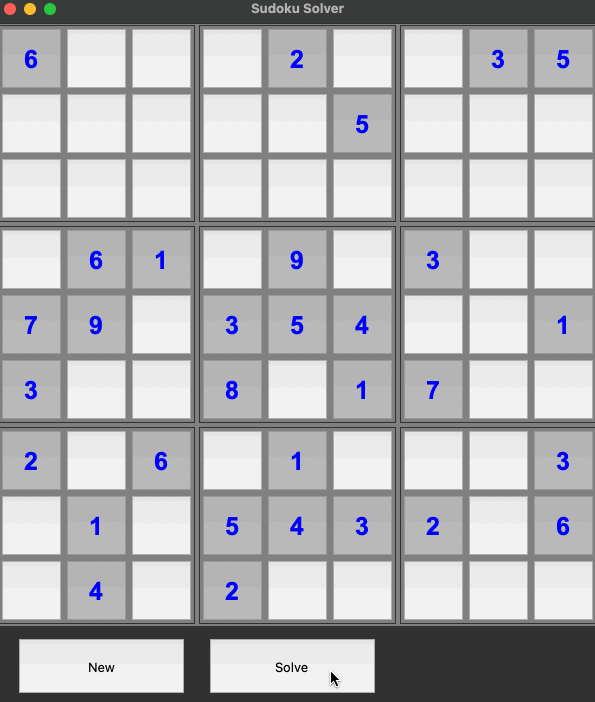

# Sudoku Solver
A simple Sudoku Solver implemented in Python using Tkinter for the GUI.

## Introduction
This project is created with the goal of demonstrating the backtracking algorithm visually with a game of sudoku.

## Features
- Solves Sudoku Puzzles using a backtracking algorithm
- Visualizes the solving process step by step
- User-friendly GUI with buttons to input numbers.
- Generates a new Sudoku puzzle on demand.

## Demo


## Usage
1. Clone the repository:
```bash
git clone https://github.com/CalvinChe/SudokuSolver
cd SudokuSolver
```
2. Run the Sudoku Solver:
```bash
python3 sudokuGui.py
```
3. Press the Solve Button
